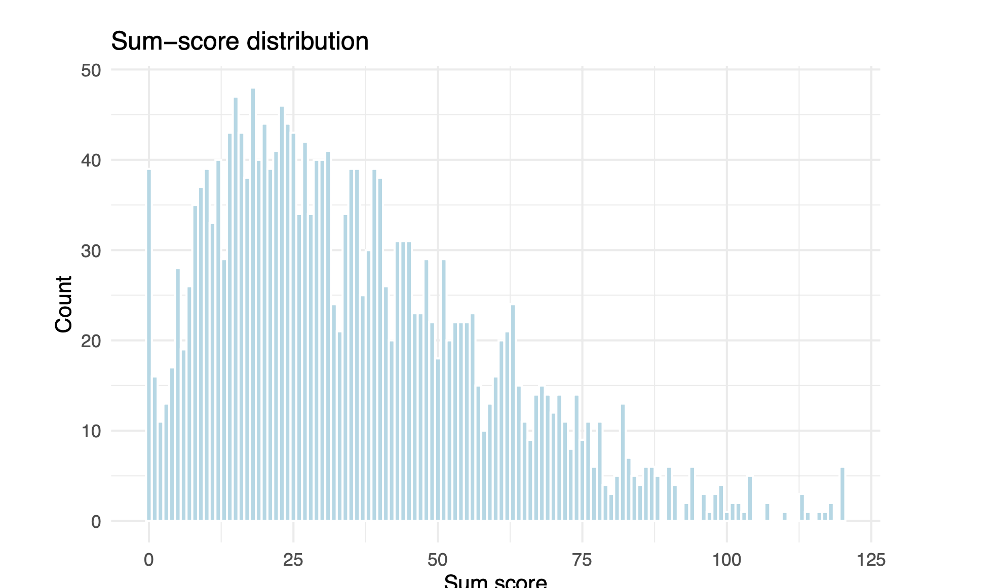
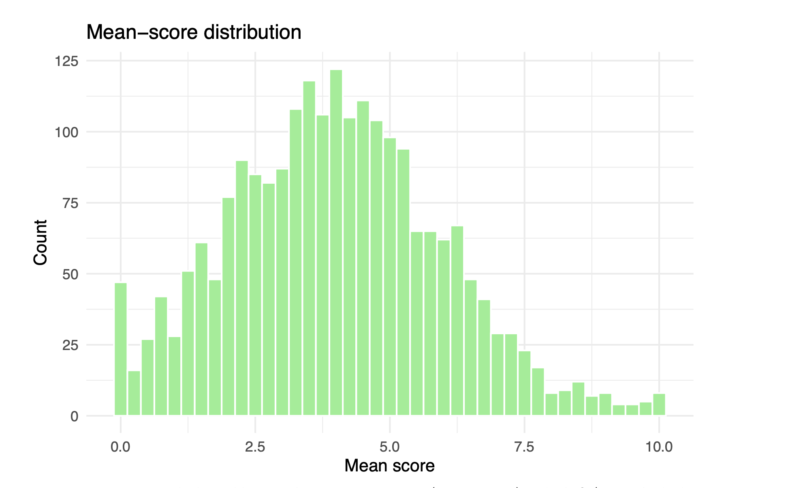

## Overview

For this GV300 assignment, I worked with a set of Q37 survey questions to explore key measurement issues in political and social research. The goal was not just to describe the answers, but also to evaluate whether a set of questions could be used as a reliable scale. This included examining missing data, checking internal consistency, and comparing different ways to build a composite metric.

## Why this matters

Measurement is one of the most important parts of quantitative research. If a variable is poorly measured, even well-designed statistical analysis can become misleading. In this assignment, I focused on whether the Q37 battery provides a dependable way of measuring trust in the central bank and whether it should be combined into a single scale.

## Exploring the battery

The Q37 battery contains several cells designed to measure the same basic concept. Before combining them, it is important to understand how many elements there are, whether they use a common response format, and how much data is missing.

<details>
<summary><strong>Show code</strong></summary>
```{r, eval=FALSE}
load("run_unbanked.RData")
```

```{r, eval=FALSE}
# your code here
library(tidyverse)
library(psych)


q37_names <- grep("^Q37_", names(run_unbanked), value = TRUE)
length(q37_names)

table(run_unbanked$Q37_1, useNA = "ifany")
table(run_unbanked$Q37_2, useNA = "ifany")
```
</details>

## What this code does
This code identifies all the survey elements in the Q37 set and verifies the distribution of responses across the first two elements. It helps to determine whether a data set matches the overall scale and whether there are significant gaps that may affect subsequent analysis.

## Missing data and reliability
One of the most important findings in this project is that missingness is not a minor issue. Only around 46.3% of respondents are complete on all Q37 items, meaning that listwise deletion would remove more than half of the sample. Another variable in the dataset, Q76, has about 61.1% missingness, which further illustrates how serious the missing-data problem can be. These patterns suggest that missingness should be diagnosed carefully rather than ignored.

At the same time, the reliability analysis produced a Cronbach’s alpha of approximately 0.93. This is a very high value, indicating strong internal consistency across the 12 items. In practical terms, this suggests that the Q37 battery is measuring a common underlying concept rather than a set of unrelated attitudes.

<details> 
<summary><strong>Show code</strong></summary>
```{r, eval=FALSE}
q37_complete <- complete.cases(run_unbanked[, q37_names])
percent_complete <- mean(q37_complete) * 100

mean(is.na(run_unbanked$Q76)) * 100

q37_num <- run_unbanked[, q37_names]
alpha_result <- psych::alpha(q37_num)
alpha_result$total$raw_alpha
```
</details>

## Interpreting the results
The results show an ambiguous picture. On the one hand, the Q37 battery is highly reliable because the batteries are closely connected to each other. This suggests that they reflect a common underlying concept rather than measuring unrelated relationships. On the other hand, missing data is not trivial. If list deletion had been used, more than half of the sample would have been lost, which could have distorted the results or reduced the representativeness of the analysis. Taken together, these results indicate that the scale itself is quite reliable, but the lack of information about it should be taken seriously.

## Building the scale
Building the scale
The assignment compared two ways of summarising the battery: a sum score and a mean score. Both contain the same underlying information, but the mean score is easier to interpret because it preserves the original 0–10 response scale. It is also more flexible when some items are missing, since a respondent can still receive a mean score even if they skipped one or two questions. For these reasons, I would prefer to report the mean score in a paper

<details> <summary><strong>Show code</strong></summary>

```{r, eval=FALSE}
q37_num <- run_unbanked[, q37_names]

sum_score_ex <- rowSums(q37_num, na.rm = TRUE)
mean_score_ex <- rowMeans(q37_num, na.rm = TRUE)

scale_df <- data.frame(
  sum_score = sum_score_ex,
  mean_score = mean_score_ex
)
```
</details>

## Visualisation



## Understanding the figure
The histogram shows how the respondents are distributed on the average confidence scale. Since the average score remains on the initial response scale from 0 to 10, it is much easier to interpret than the final score. Lower values indicate a lower level of trust, while higher values indicate greater trust. The distribution also makes it easier to see if the responses are grouped around a center or if there are significant differences between respondents.

## Group Comparison
In the final part of the task, the scale of trust between the groups receiving education was compared. This does not establish a causal relationship, but it is useful for identifying patterns and thinking about how measurement may vary depending on social groups. In the assignment, education was used as a grouping variable for this comparison.


<details> 
<summary><strong>Show code</strong></summary>
```{r, eval=FALSE}
group_var <- "edu"

tmp_df <- data.frame(
  group = run_unbanked[[group_var]],
  mean_score = mean_score_ex
)

ggplot(tmp_df, aes(x = as.factor(group), y = mean_score)) +
  geom_boxplot(fill = "grey90") +
  theme_minimal(base_size = 12) +
  labs(
    x = "Education level",
    y = "Mean Q37 score",
    title = "Trust scale by education"
  )
```
</details>

## The key conclusion
This project shows why measurements deserve close attention before embarking on any significant modeling. The Q37 battery is highly reliable, which allows you to combine the parameters into a single confidence scale. However, the large amount of missing data means that the scale construction is not only a technical problem, but also a potential source of distortion. In general, I would give the average score rather than the total, as it is more interpretable and better suited to data with incomplete answers to questions.


## A source
This project is based on my GV300 Assignment 5 assignment on measurements, reliability, validity, and scale construction. The uploaded task describes the Q37 batteries, defect-free checks, reliability analysis, and scale construction steps.The main conclusion
This project shows why measurements deserve close attention before embarking on any significant modeling. The Q37 battery is highly reliable, which allows you to combine elements into a single confidence scale. However, the large amount of missing data means that the scale construction is not only a technical problem, but also a potential source of distortion. In general, I would give the average score rather than the total, as it is more interpretable and better suited to data with incomplete answers to questions.
A source
This project is based on my GV300 Assignment 5 assignment on measurements, reliability, validity, and scale construction. The uploaded task describes the Q37 batteries, defect-free checks, reliability analysis, and scale construction steps.

[← Back to Projects](GV300Showcase.html)