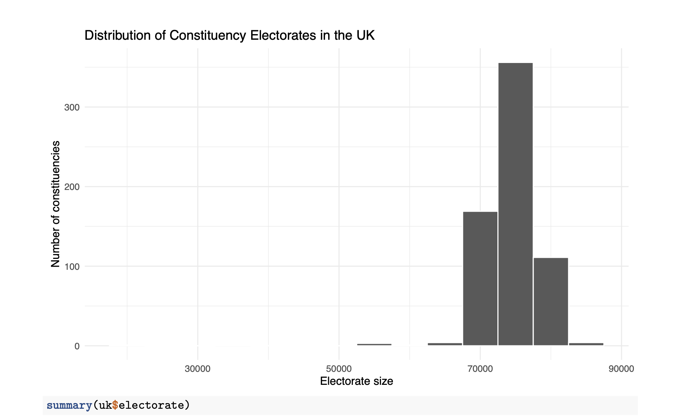

## Overview

This project examines voter turnout across UK constituencies, focusing on who participates in elections and who does not. While previous analysis considered whether all votes are equal, this project shifts attention to turnout inequality and political participation. This is important because election outcomes depend not only on how people vote, but also on who actually turns out to vote.

---

## Data preparation
I loaded data that in order to create structured turn out results the data must be clean. 

<details>
<summary><strong>Show code</strong></summary>

```{r, eval=FALSE}
uk_csv <- "https://electionresults.parliament.uk/general-elections/6/candidacies.csv" uk_raw <- readr::read_csv(uk_csv, show_col_types = FALSE)
names(uk_raw) <- names(uk_raw) %>% tolower() %>% str_replace_all("\\s+", "_")
```
</details>

## Turn out categories

The cleaned dataset contains 650 constituencies across the United Kingdom. 
Each observation represents a single constituency and includes information on:

- country
- constituency name
- total valid votes
- electorate size
- turnout rate (percentage)

## Main goal
A key finding of the analysis is that a large number of individuals do not participate in elections. In many constituencies, especially in large urban areas such as Birmingham, Manchester, and Leeds, tens of thousands of eligible voters do not vote.

## Understanding the constituency varieties
Election outcomes reflect only those who vote, not the entire electorate. In areas with low turnout, representatives may be elected with support from only a small proportion of the population

## Visualisation 
<details>
<summary><strong>Show code</strong></summary>
```{r, eval=FALSE}
ggplot(uk, aes(electorate)) + geom_histogram(binwidth = 5000, color = "white") + labs(
    title = "Distribution of Constituency Electorates in the UK",
    x = "Electorate size",
    y = "Number of constituencies"
)+ theme_minimal()
```
</details>


## Interpretation
Most constituencies fall into the "Medium" turnout category, particularly in England. However, there is variation across regions. Scotland and Wales show more low-turnout constituencies, while Northern Ireland is more clustered.
These categories help summarise turnout but also simplify a continuous variable. This means they can hide more subtle differences between constituencies.

## High vs low turnout
The comparison between high-turnout and low-turnout constituencies shows that turnout differences are not primarily driven by electorate size. Instead, they reflect deeper social and demographic factors.
Low-turnout areas tend to be more urban, younger, and economically disadvantaged, while high-turnout areas are often more rural, older, and affluent.

## Key conclusion
The analysis demonstrates that political inequality is not only about differences in constituency size, but also about differences in participation. Large numbers of non-voters, especially in urban areas, suggest that electoral outcomes may not fully represent the preferences of the entire population.
Understanding turnout is therefore essential for evaluating the fairness and representativeness of democratic systems.

[← Back to Projects](GV300Showcase.html)